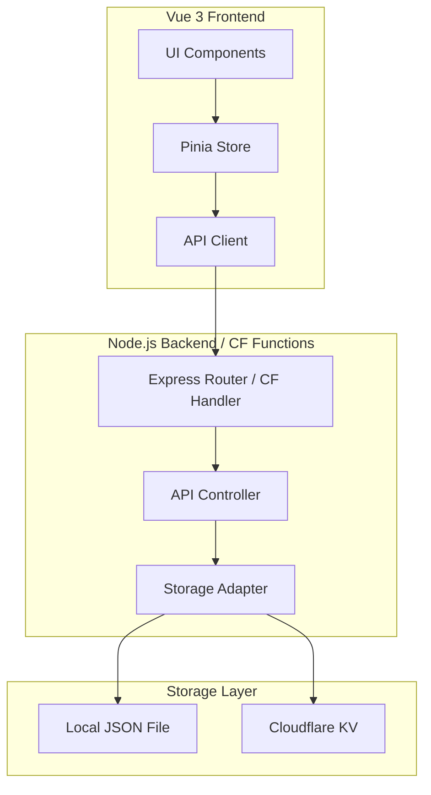

# Design Document: Nav Portal

## Overview

Nav Portal 是一个灵活的导航页应用，采用前后端分离架构。前端使用 Vue 3 + TypeScript 构建 SPA，后端使用 Node.js Express 提供 API 服务。通过存储适配器模式支持本地文件存储和 Cloudflare KV 存储，实现多环境部署。

## Architecture



## Components and Interfaces

### Frontend Components

```
src/
├── components/
│   ├── Sidebar.vue          # 左侧边栏：分类列表、编辑开关、设置按钮
│   ├── CategoryList.vue     # 分类列表组件
│   ├── NavGrid.vue          # 右侧导航项网格
│   ├── NavCard.vue          # 单个导航卡片
│   ├── EditModal.vue        # 编辑导航项/分类的模态框
│   └── SettingsModal.vue    # 设置模态框
├── stores/
│   └── navStore.ts          # Pinia 状态管理
├── api/
│   └── client.ts            # API 请求封装
├── types/
│   └── index.ts             # TypeScript 类型定义
└── App.vue
```

### Backend Structure

```
server/
├── index.ts                 # Express 服务入口
├── routes/
│   └── api.ts               # API 路由定义
├── controllers/
│   └── navController.ts     # 业务逻辑控制器
├── storage/
│   ├── adapter.ts           # 存储适配器接口
│   ├── localAdapter.ts      # 本地文件存储实现
│   └── kvAdapter.ts         # Cloudflare KV 存储实现
└── middleware/
    └── auth.ts              # API Key 验证中间件

functions/                   # Cloudflare Pages Functions
└── api/
    └── [[path]].ts          # 动态路由处理
```

### TypeScript Interfaces

```typescript
interface Category {
  id: string;
  name: string;
  order: number;
}

interface NavItem {
  appid: string;        // 唯一标识
  name: string;         // 显示名称
  description: string;  // 描述
  link: string;         // 跳转链接
  icon?: string;        // 图标 URL 或 emoji
  categoryId: string;   // 所属分类 ID
  order: number;        // 排序
}

interface AppSettings {
  apiKey: string;       // Webhook API 密钥
}

interface AppData {
  categories: Category[];
  navItems: NavItem[];
  settings: AppSettings;
}

interface StorageAdapter {
  getData(): Promise<AppData>;
  saveData(data: AppData): Promise<void>;
  getNavItem(appid: string): Promise<NavItem | null>;
  updateNavItemLink(appid: string, link: string): Promise<boolean>;
}
```

## Data Models

### 默认数据结构

```json
{
  "categories": [
    { "id": "all", "name": "全部", "order": 0 }
  ],
  "navItems": [],
  "settings": {
    "apiKey": ""
  }
}
```

### 存储位置

- **本地部署**: `data/nav-data.json`
- **Cloudflare**: KV namespace `NAV_PORTAL_DATA`，key: `app-data`

## API Endpoints

### GET /api/link
获取导航项链接

**Query Parameters:**
- `key`: API 密钥
- `appid`: 导航项 ID

**Response:**
```json
{
  "success": true,
  "link": "https://example.com"
}
```

### POST /api/link
更新导航项链接

**Query Parameters:**
- `key`: API 密钥
- `appid`: 导航项 ID
- `link`: 新链接

**Response:**
```json
{
  "success": true,
  "message": "Link updated"
}
```

### GET /api/data
获取所有数据（前端使用）

### POST /api/data
保存所有数据（前端使用）


## Error Handling

### API 错误响应

```typescript
interface ApiError {
  success: false;
  error: string;
  code: number;
}
```

| 场景 | HTTP Status | Error Message |
|------|-------------|---------------|
| API Key 无效 | 401 | "Invalid API key" |
| AppID 不存在 | 404 | "AppID not found" |
| 缺少必要参数 | 400 | "Missing required parameter: {param}" |
| 服务器错误 | 500 | "Internal server error" |

### 前端错误处理

- 网络错误：显示 toast 提示，支持重试
- 验证错误：表单字段高亮显示错误信息
- AppID 重复：创建时实时检查并提示

## Correctness Properties

*A property is a characteristic or behavior that should hold true across all valid executions of a system-essentially, a formal statement about what the system should do.*

### Property 1: AppID 唯一性约束
*For any* NavItem 集合和任意新增的 NavItem，如果新 NavItem 的 appid 已存在于集合中，则添加操作应被拒绝，集合保持不变
**Validates: Requirements 3.5, 3.6**

### Property 2: 分类过滤正确性
*For any* 分类 ID（非"全部"）和任意 NavItem 集合，过滤后的结果应只包含 categoryId 等于所选分类 ID 的项，且不遗漏任何匹配项
**Validates: Requirements 2.2**

### Property 3: "全部"分类完整性
*For any* NavItem 集合，选择"全部"分类时显示的项数应等于集合中所有项的总数
**Validates: Requirements 2.1**

### Property 4: 分类删除后的项重分配
*For any* 被删除的分类，该分类下的所有 NavItem 的 categoryId 应被更新为"all"
**Validates: Requirements 2.5**

### Property 5: 数据持久化往返一致性
*For any* AppData 对象，保存到存储后再读取，得到的数据应与原始数据结构相等
**Validates: Requirements 4.1, 4.2, 4.3**

### Property 6: API 链接更新往返一致性
*For any* 有效的 appid 和新链接值，通过 POST 更新后，GET 请求应返回相同的链接值
**Validates: Requirements 5.1, 5.2, 5.3, 5.4**

### Property 7: 数据导入导出往返一致性
*For any* AppData 对象，导出为 JSON 后再导入，得到的数据应与原始数据相等
**Validates: Requirements 6.3, 6.4**

## Testing Strategy

### 单元测试
- 存储适配器的读写操作
- AppID 唯一性验证逻辑
- 分类过滤逻辑
- API Key 验证中间件
- 分类删除后的项重分配逻辑

### 属性测试 (Property-Based Testing)
使用 fast-check 库进行属性测试，每个属性测试运行至少 100 次迭代：

- **Property 1**: 生成随机 NavItem 集合，尝试添加重复 appid，验证被拒绝
- **Property 2**: 生成随机分类和导航项，验证过滤结果正确性
- **Property 3**: 生成随机导航项集合，验证"全部"分类显示完整
- **Property 4**: 生成随机分类和关联项，删除分类后验证项被重分配
- **Property 5**: 生成随机 AppData，验证存储往返一致性
- **Property 6**: 生成随机 appid 和链接，验证 API 更新往返一致性
- **Property 7**: 生成随机 AppData，验证导入导出往返一致性

### 集成测试
- API 端点的完整请求/响应流程
- 前后端数据同步
- 存储适配器切换
- 错误场景：无效 API Key、不存在的 appid

### E2E 测试
- 编辑模式下的 CRUD 操作流程
- 设置页面的配置保存
- 数据导入导出流程
